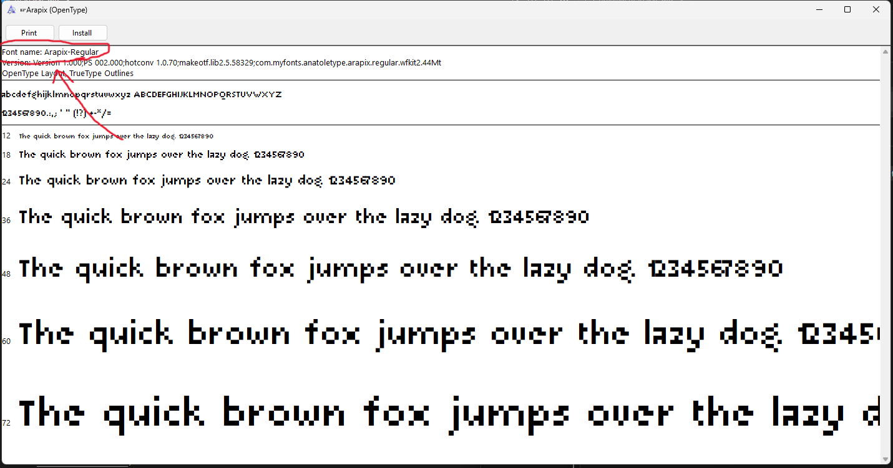
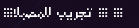
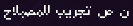

  

# ترجمة ليست منتهية + المشاكل.

أنا لا اتذكر متى بدات بهذه ترجمة لكن تركته لفترة طويلة, لذا قررت أن ارفعه على قت هب

هذه ترجمة تحتوي على كثير من خطاء اللغوية بسبب أني لا اكتب بلعربية كثيرا, لهذه سبب أنا لا اولاحض بعض أخطاء اللغوية.

.لذا توقع أن تجد الكثير منه + بعض صور تبدو جدأء سيء

.أنا ارفع هذه ملفات هنا لعل وعسى أحد يستفيد منهم او يكمل الترجمة

أنا نتهيت من كتابت كل هذه, اذا رأيت اخطاء في كتابة, هذه بسبب أني لم اراجع ما كتبته, سوف أفعل هذه لاحقا.
# Translation not finished + the problems.
I don't remember when I started this translation but I left it for a long time, so I did decide to just upload it to Github.

This translation contains a lot of linguistic errors because I do not type in Arabic often, this is why I don't notice those linguistic errors.

So expect a lot of of those + some images looks very bad.

I'm uploading those files here in hope of someone benfiting from them or compelete the translation.

I just finished typing all of this, if you seen any misspellings, that's because I didn't reread what I typed, I'll do this later.

# الخطوط.
أنا لا اعرف من اين وجدت خط Arapix لكن أضن ان Sylvain Mazas و Anatoletype صنعوه؟ لكن لا اعرف اي شيء غير ذالك.

وأنا لا اتذكر ما هيا خطوط الذي استعملته في صور لكن خط واحد وهو خط [Pixel AE](https://alexclay.itch.io/arabic-pixel-font-b).

# The fonts.
I don't know from where I got Arapix font but I think Sylvain Mazas and Anatoletype created it? But I don't know anything beside that.

And I don't know what were the fonts that I used in the pictures but one font which is [Pixel AE](https://alexclay.itch.io/arabic-pixel-font-b).

# تحميل ترجمة.

تستطيع ان تحمل ترجمة بان تحمل ملفات [هنا](https://github.com/ThefakeJeremy/Oneshot-arabic-translation-wip/releases/tag/FirstNonFinshed_version) وثما تفك ضغط ملف وتضع ملفات داخل ملف `Oneshot-arabic-translation-wip-main` في ملفات OneShot.

أذا كنت تستعمل نسخة ستيم, اذهب لمكتبت العابك(Library) و اجد OneShot و اذهب الى علامه مسننن وثما `Manage > Browse local files` وهذه يجب أن يفتح ملفات لعبة.

الان افتح لعية, اذهب الى أعدادات(Settings) واذهب الى خيار اللغة(Language) و اضغط سهم يمين, وهذه يجب أن يجعل لعبة بللغة العربية, او تستطيع أن تخرج وتدخل لعبة مرا أخري لترء خلفية قأمة رئيسية تتغير.

# Installing the translation.
You can download the translation [here](https://github.com/ThefakeJeremy/Oneshot-arabic-translation-wip/releases/tag/FirstNonFinshed_version)  and then unzip the file and put the contents of `Oneshot-arabic-translation-wip-main` inside OneShot files.

If you were using the steam version, go to `Library` and find OneShot and then go to the cog icon and then `Manage > Browse local files` and that should open Oneshot files.

Now open the game, go to settings and then go to the languages option and press right arrow, that should change the game to the arabic language, or you can quit the game and open it again to see the main menu background changing.

# تقدم ترجمة.

المنزل: 100%؟

.أنا اتذكر وجود كلام غير مترجم لكن لا استطيع أن اجده الان

حرق يمكن؟

البارنز: ???%

أنا لا اعرف أن احسب بل مئة, لكن انجزت المنطقة علوية و الى سيلفر لكن لم انهي ترجمت كل كلامة, البداية مترجمة لكن سوف ينتهي بكلام فرنسي.

الغلين: ؟%؟

بينما أنا لم اترجم أى شيء لقد عدلت بعض صور و كلام خروج.

الريف يوح: 2% يمكن؟

.أنا لم أترجم اى نصوص هناك بعد

%البرج: 0

%سولستيس: 0

# Translation progress.
The house: 100%?

I remember there being dialogue that remained untranslated but I can't find it now

Spoilers maybe?

The barrens: ???%

I don't know how to calculate the precntage but I finished the upper area and til Sliver but I didn't finish translating all of her dialogue, the beginning is translated but it will with french.

The glen: ?%?

While I didn't translate anything, I did edit some sprites and the exit dialogue.

The refuge: 2% Maybe?

I still haven't translated any text there.

The tower: 0%

Solstice: 0%

# كيفية تعديل؟
هذه جزء هنا لكي أوضح بعض أشياء و المشاكل.

أولا, أقراء هذه: [كيفية صناعت ترجمة للعبة.](https://steamcommunity.com/app/420530/discussions/2/3598968030055831716)

1. تغير خط؟

أنا عانيت مع هذه جزء أنه لم يقبل أى خط, لكن بينما أنه لا يقبل كل خطوط, الطريقة صحيح لوضع خط جديد هو استعمال أسم داخل ملف خط, اضغط مرتين على خطك وهذه يجب أن يفتح:

  

`language_fonts.ini`أسم خط", استعمل هذه في"

و هذه يجب أن يعمل, اذا لم ينجح, غير خط.

2. عكس نصوص.

أذا لقد ترجمت ألعاب من قبل, أنت غالبا تعرف هذه, لكن, يجب أن تعكس كل نصوص عندما تضعة في `ar.po`

أنا استعمل هذه موقع:
[Arabic-keyboard](https://www.arabic-keyboard.org/photoshop-arabic/)

3. عندما تعكس نصوص, احذف احرف منفصله و ضعه مرا أخرى.

لست متاكد اذا انه فقط مشكلت خط مستعمل حالين لكن, عندما تعكس نصوص بدون حذف أحرف منفصلة, هذه ما سيحدث:

  

:وهذه بعد أن تصلحة

  

تجاهل أنه أنا كتبت تجريب و مصباح خطاء.

4. أنا لا أتذكر ماذا كنت سوف أضع هنا.

# How to edit?
This section is here so I can put somethings and problems.

Firs thing, read this: [How to create a fan translation.](https://steamcommunity.com/app/420530/discussions/2/3598968030055831716)

1. Changing the font?

I struggled with this part, it didn't accept any font but while it doesn't accept all fonts, the right way is to put a font is using the name in font file, click on your font and this should open:

  

"Font name", use that in `language_fonts.ini` and this should work, if it didn't, change the font.

2. Reversing the text.

If you translated games before you probably know this but you need to reverse all text when you put them in `ar.po`.

I use this site: [Arabic-keyboard.](https://www.arabic-keyboard.org/photoshop-arabic/)

3. When you reverse text remove all the seprate letters and retype them in.

I'm not sure if this is just a problem of the current font that is being used but when you reverse text without removing the seprate letters, this is what happens:

  

And this is after you fix it:

  

Ignore that I typed "تجريبي" and lightbulb wrong.

4. I don't remeber what I was gonna put here.
